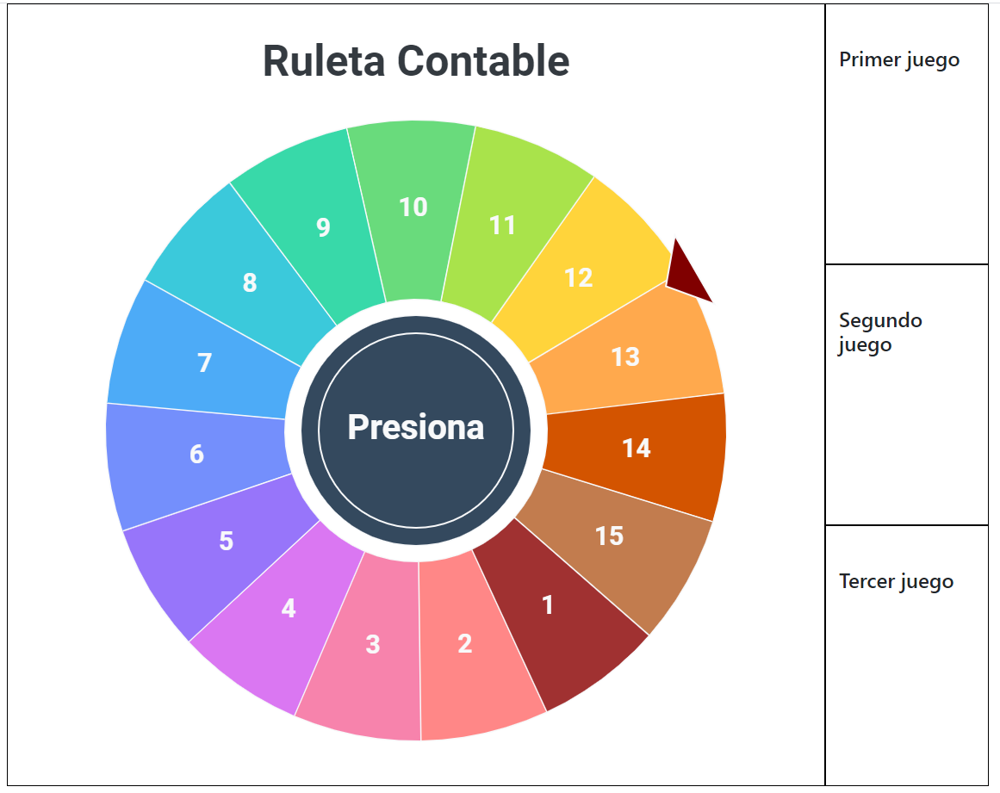
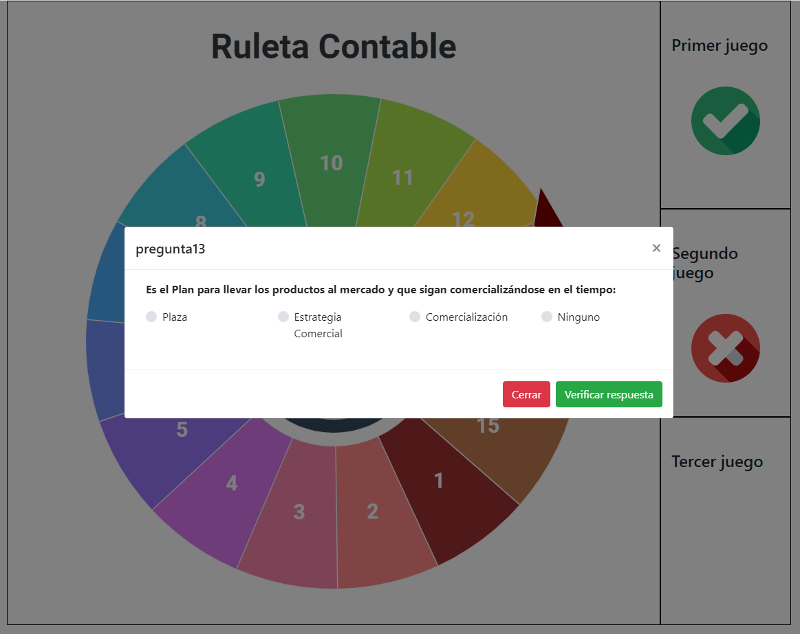

# Juego de Ruleta Contable

Juego de Ruleta Contable (sin embargo las preguntas pueden ser de cualquier índole), desarrollado para ser un juego de clases de contabilidad del colegio Domingo Savio de Sucre (2018). Implementando código ([ruleta.js](js/ruleta.js)) para renderizar una ruleta con la API Canvas de HTML5

## Dependencias

### CSS

- Bootstrap v4.1.3

### JS

- Jquery - 3.3.1
- Bootstrap v4.1.3 (incluyendo Popper)

## Capturas

~~2-2018/independiente/roulette~~
